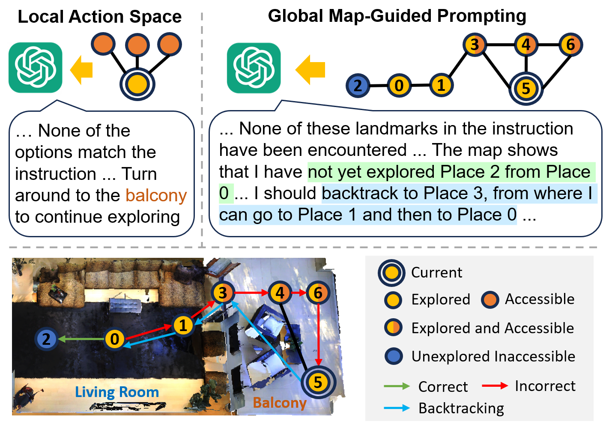
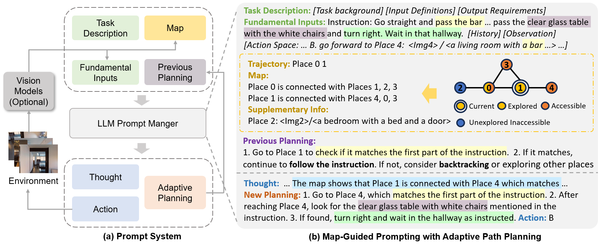

# MapGPT

The official implementation of MapGPT. [[Paper]](https://arxiv.org/abs/2401.07314) [[Project]](https://chen-judge.github.io/MapGPT/)

**MapGPT: Map-Guided Prompting with Adaptive Path Planning for Vision-and-Language Navigation.**

Jiaqi Chen, Bingqian Lin, Ran Xu, Zhenhua Chai, Xiaodan Liang, Kwan-Yee K. Wong.

Annual Meeting of the Association for Computational Linguistics (**ACL 2024**).


<!--
<p align="center">
  
</p>
-->

<p align="center">
  
</p>

If you have any questions, please contact me by email: [jqchen(at)cs.hku.hk](mailto:jqchen@cs.hku.hk)

## Setup

Install Matterport3D simulators: follow instructions [here](https://github.com/peteanderson80/Matterport3DSimulator). We use the latest version instead of v0.1.

Install requirements:
```setup
conda create -n MapGPT python=3.10
conda activate MapGPT
pip install -r requirements.txt
```

Prepare data: 
+ You can follow [DUET](https://github.com/cshizhe/VLN-DUET/) and set the [annotations](https://www.dropbox.com/sh/u3lhng7t2gq36td/AABAIdFnJxhhCg2ItpAhMtUBa?dl=0) for testing val-unseen set.
+ We sample a subset containing 72 scenes and 216 cases for quick and cost-effective testing. You can download the corresponding [MapGPT_72_scenes_processed.json](https://connecthkuhk-my.sharepoint.com/:f:/g/personal/jadge_connect_hku_hk/Eq00RV04jXpNkwqowKh5mYABBTqBG1U2RXgQ7FvaGweJOQ?e=rL1d6p) and place it in the `datasets/R2R/annotations` directory. 
+ The observation images need to be collected in advance from the simulator. You can use your own saved images or use the [RGB_Observations.zip](https://connecthkuhk-my.sharepoint.com/:f:/g/personal/jadge_connect_hku_hk/Eq00RV04jXpNkwqowKh5mYABBTqBG1U2RXgQ7FvaGweJOQ?e=rL1d6p) we have processed.

GPT key: please set your API key [here](https://github.com/chen-judge/MapGPT/blob/00582fb08328646f9a9dd6b923c474cfb043d570/GPT/api.py#L10).
## Inference

In addition to the reported results of GPT-4v in the paper, we have also included the implementation of latest GPT-4o which is faster and cheaper.

You can run the following script where `--llm` is set as `gpt-4o-2024-05-13` and `--response_format` is set as `json`.

```bash
bash scripts/gpt4o.sh
```

The performance comparison between two implementations on a sampled subset is as follows. GPT-4o can achieve better NE but slightly worse SR.

| LLMs | NE | OSR | SR | SPL |
| --- | --- | --- |  --- | --- |
| GPT-4v | 5.62 | 57.9 | 47.7 | 38.1 |
| GPT-4o | 5.11 | 56.9 | 46.3 | 37.8 |

Note that you should modify the following part in gpt4o.sh to set the path to your observation images, the split you want to test, etc.

```bash
--root_dir ${DATA_ROOT}
--img_root /path/to/images
--split MapGPT_72_scenes_processed
--end 10  # the number of cases to be tested
--output_dir ${outdir}
--max_action_len 15
--save_pred
--stop_after 3
--llm gpt-4o-2024-05-13
--response_format json
--max_tokens 1000
```

## Citation
<pre>
@inproceedings{chen2024mapgpt,
  title={MapGPT: Map-Guided Prompting with Adaptive Path Planning for Vision-and-Language Navigation},
  author={Chen, Jiaqi and Lin, Bingqian and Xu, Ran and Chai, Zhenhua and Liang, Xiaodan and Wong, Kwan-Yee~K.},
  booktitle = "Proceedings of the 62nd Annual Meeting of the Association for Computational Linguistics",
  year={2024}
}
</pre>
